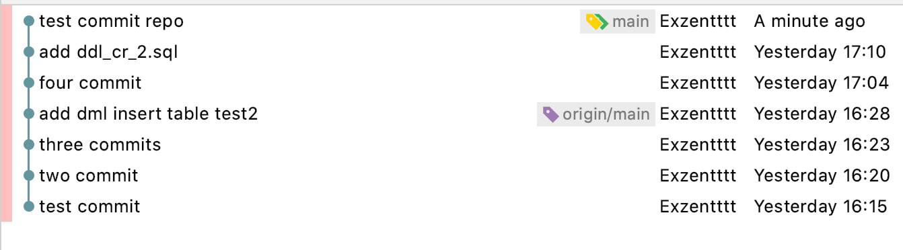

# Краткое руководство по использованию gitdiff2fly

## Введение

GitDiff2Fly - это помощник по созданию структуры каталогов для Flyway. Flyway — это инструмент для контроля версии базы данных. В рамках проекта мы храним отдельные sql файлы (так называемые миграции), которые хранят в себе все то, что мы делаем с БД за один раз. 

Все миграции идут строго в определенном порядке, что позволяет отследить изменения в структуре и данных БД (часто при помощи миграции добавляют тестовые данные в проект, чтобы при разворачивании его на какой-то сервер он уже имел какие-то значения, при помощи которых можно тестировать проект). После того, как пройдут тесты, при сборке проекта запускаются миграции. Они соединяются с базой данных и проводят миграции. Если миграции уже были проведены на этой базе данных, то flyway их просто пропустит (у него в БД в отдельной таблице хранятся данные о миграциях, об их состоянии, что помогает управлять ими), а если какая-то миграция прошла неуспешно, то сборка проекта и его монтирование (деплой) на сервер остановятся.

 Для работы с миграциями и упорядочиванием структуры хранения, предлагается использовать GitDiff2Fly. GitDiff2Fly - это помощник по созданию структуры каталогов для Flyway.

**Полезные ссылки**: 

1. https://flywaydb.org/ 
2. https://javarush.ru/groups/posts/3157-java-proekt-ot-a-do-ja-springboot--flyway
3. https://habr.com/ru/post/141354/

## Принцип работы

В TeamCity запускаются два контейнера по docker файлам Dockerfile.flyway, Dockerfile.gitdiff2fly.

При каждом push-е (пуше) версии в основной репозитория **Flyway**, **TeamCity** автоматически подхватывает и обновляет сущности БД (по последнему релизу и приоритету).

Cтоит отметить, что приоритетность выполнения файлов в миграции напрямую зависит от наименования.

| Действие                                                     | Префикс в названии файла | Расширение файла | Приоритет |
| ------------------------------------------------------------ | ------------------------ | ---------------- | --------- |
| Cоздание и определение таблицы - CREATE (возможны дополнительные действия с таблицей) | DDL_CR                   | .SQL             | 1         |
| Добавлении, удалении, модификации для сущностей текущей миграции - ALTER | DDL_AL                   | .SQL             | 2         |
| Процедуры, триггеры, функции                                 | Без префикса             | .SQL             | 3         |
| Манипуляции с данными - INSERT, UPDATE, DELETE и т.д.        | DML_                     | .SQL, .JAVA      | 4         |
| Десктруктивные действия (удаление таблиц, процедур, полей) - DROP | DDL_DR                   | .SQL             | 5         |

## Работа с GitDiff2Fly

Рассмотрим действие программы на наглядном примере.

Создадим репозитории для работы с **gitdiff2fly**. 

Для этого нужно выполнить следующие действия:

|  №   | Описание                                                     |                           Действие                           |
| :--: | :----------------------------------------------------------- | :----------------------------------------------------------: |
|  1   | Создаём новый каталог tmp_test                               |                      **mkdir tmp_test**                      |
|  2   | Переходим в каталог tmp_test                                 |                       **cd tmp_test**                        |
|  3   | Создаём в каталоге tmp_test репозиторий без рабочего каталога.                                                          Подробнее можно почитать здесь: [https://coderoad.ru/7861184/В-чем-разница-между-git-init-и-git-init-bare](https://coderoad.ru/7861184/В-чем-разница-между-git-init-и-git-init-bare) |                     **git init --bare**                      |
|  4   | Возвращаемся назад                                           |                          **cd ..**                           |
|  5   | Создаём репозиторий для Flyway                               |               **git clone tmp_test tmp_test2**               |
|  6   | Создаём или клонируем готовый репозиторий, где будут храниться наши файлы для подготовки сборок | **git clone url test_repo** или **mkdir test_repo & git init** |
|  7   | Переходим в каталог и начинаем работать                      |                       **cd test_repo**                       |

Консольное представление

```bash
mkdir tmp_test
cd tmp_test
git init --bare
cd ..
git clone tmp_test tmp_test2

git clone url test_repo
cd test_repo
```

Полученную схему репозиториев можно посмотреть ниже:


У нас есть директория test_repo, в которой хранятся наши скрипты для миграций Flyway


Мы создали ещё несколько тестовых файлов для нашей задачи: 

| Файл            | Содержание                                                   |
| --------------- | ------------------------------------------------------------ |
| 1_deps.txt      | Пустой файл .txt                                             |
| file_ignore.txt | test                                                         |
| ddl_cr_3.sql    | CREATE TABLE test3 (   test_id int NOT NULL,   test_name char(50) NOT NULL ); |
| dml_3.sql       | INSERT INTO test3 VALUES ('1', '2', '3', '4');               |
| ddl_dr_3.sql    | DROP TABLE test3;                                            |

В GitDiff2Fly перед запуском можно посмотреть список аргументов, с которыми умеет работать программа, для этого нужно вызвать следующую команду:

```bash
$> ./gitdiff2fly -help        

GitDiff2Fly (C) Copyright 2021 by Andrey Batalev

  -flyway-repo-path string
        path of flyway repository (default "../flyway")
  -help
        Show usage
  -next-version string
        version of next release (default "SNAPSHOT") 
```

Описание флагов:

| Аргумент          | Описание                                                     |
| ----------------- | ------------------------------------------------------------ |
| -flyway-repo-path | Отвечает за указание репозитория с Flyway миграциями         |
| -help             | Просмотр аргументов, которые можно использовать при работе   |
| -next-version     | Указываем версию релиза, если версия релиза не указана, то создаётся snapshot (пример: ../tmp_test2/src/snapshot_2021_07_04_22_06_55). Snapshot нужны для того, чтобы посмотреть/потестировать результаты, но не пушить в основной репозиторий. Для пуша в основной репозиторий нужно обязательно указать версию |

Пробуем вызвать **gitdiff2fly** и получаем ответ, что последний коммит соответствует последнему коммиту, записанному в файл last_commit, поэтому программа ничего не делает и пропускает выполнение.

```bash
test_repo $> ./gitdiff2fly -flyway-repo-path=../tmp_test2  

GitDiff2Fly (C) Copyright 2021 by Andrey Batalev

=> analyze current repository
 current commit: 80dcf4c00a31c65f9d369c8b347ff2f3ba32126e
    last commit: 80dcf4c00a31c65f9d369c8b347ff2f3ba32126e

=> analyze commits

current commit already in flyway repository. skipped
=> the end.
```

Давайте закоммитим наш результат:

```bash
test_repo $> git commit -m 'test commit repo' 
           
[main d3295e7] test commit repo
 6 files changed, 10 insertions(+)
 create mode 100644 1_deps.txt
 create mode 100644 ddl_cr_3.sql
 create mode 100644 ddl_dr_3.sql
 create mode 100644 dml_3.sql
 create mode 100644 file_ignore.txt
 create mode 100644 select_test.sql
```

Мы закоммитили 6 файлов в репозитории **test_repo**, можем посмотреть его в логе GIT



Теперь приступаем к запуску **gitdiff2fly** и видим, что в создалась директория snapshot и промаркировались файлы. Snapshot стоит использовать для просмотра результатов работы программы и тестирования разных вариации.

Сначала программа сравнила последний коммит в репозитории с последним коммитом в файле last_commit. Увидела, что коммиты не совпадают и приступила к маркировке файлов по приоритетности. Файл file_ignore.txt не попал в snapshot, как было и задумано логикой. 

 > ```bash
 > test_repo $> ./gitdiff2fly -flyway-repo-path=../tmp_test2
 > 
 > GitDiff2Fly (C) Copyright 2021 by Andrey Batalev
 > 
 > => analyze current repository
 >  current commit: d3295e70aa1a67a88b95a09118b577ab92fcb64d
 >     last commit: 80dcf4c00a31c65f9d369c8b347ff2f3ba32126e
 >                # A      1_deps.txt
 >                # A      ddl_cr_3.sql
 >                # A      ddl_dr_3.sql
 >                # A      dml_3.sql
 >                # A      file_ignore.txt
 >                # A      select_test.sql
 > 
 > => mark files
 > 
 >  > found dependencies file 1_deps.txt
 >  > skip file_ignore.txt
 >  > => create build
 >  > parse dependencies file 1_deps.txt
 >  > created ../tmp_test2/src/snapshot_2021_07_04_22_06_55/V2021_07_04_22_06_55_0__ddl_cr_3.sql
 >  > created ../tmp_test2/src/snapshot_2021_07_04_22_06_55/V2021_07_04_22_06_55_1__select_test.sql
 >  > created ../tmp_test2/src/snapshot_2021_07_04_22_06_55/V2021_07_04_22_06_55_2__dml_3.sql
 >  > created ../tmp_test2/src/snapshot_2021_07_04_22_06_55/V2021_07_04_22_06_55_3__ddl_dr_3.sql
 >  > => the end.
 > ```

Теперь наш репозиторий flyway выглядит следующим образом (для сравнения можно вернуться к таблице приоритетности):


Попробуем теперь указать версию для миграции и посмотрим на результат. 

```bash
test_repo $> ./gitdiff2fly -next-version=1.4 -flyway-repo-path=../tmp_test2

GitDiff2Fly (C) Copyright 2021 by Andrey Batalev

=> analyze current repository
 current commit: d3295e70aa1a67a88b95a09118b577ab92fcb64d
    last commit: 80dcf4c00a31c65f9d369c8b347ff2f3ba32126e
               # A      1_deps.txt
               # A      ddl_cr_3.sql
               # A      ddl_dr_3.sql
               # A      dml_3.sql
               # A      file_ignore.txt
               # A      select_test.sql

=> mark files

found dependencies file 1_deps.txt
skip file_ignore.txt
=> create build
parse dependencies file 1_deps.txt
created ../tmp_test2/src/release_1_4/V1_4_0__ddl_cr_3.sql
created ../tmp_test2/src/release_1_4/V1_4_1__select_test.sql
created ../tmp_test2/src/release_1_4/V1_4_2__dml_3.sql
created ../tmp_test2/src/release_1_4/V1_4_3__ddl_dr_3.sql
=> make release
saved last_commit
execute git [add src/release_1_4]
execute git [add last_commit]
execute git [commit -m version 1.4]
execute git [tag changeset_d3295e70aa1a67a88b95a09118b577ab92fcb64d]
execute git [tag v1.4]
execute git [push --tags origin master]
=> the end.
```

Мы видим похожую картину, что и была раньше, только после создание релиза (папка release_1_4), в Git-е происходит действия с добавление файлов в коммит, установкой тэга и пуша в репозиторий.

Если посмотреть на лог гита, то мы видим, что данные успешно запушились в репозиторий Flyway.


Стоит отметить, что если мы хотим поменять приоритет, то мы можем создать файл **1_deps.txt** и указать зависимости через пробел. Например мы создали два файла **1.sql, 2.sql** и хотим изменить порядок миграции так, чтобы первым был 2.sql. Для этого мы прописываем в файл **1__deps.txt**  следующую строку, **тем самым указывая, что 1.sql зависит от 2.sql**

```bash
Содержание файла 1_deps.txt

1.sql 2.sql
```

Запускаем **gitdiff2flyway** и видим следующий результат.

